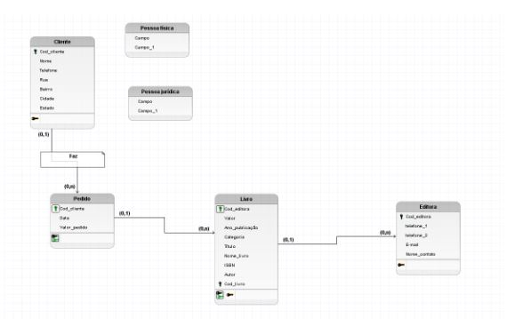
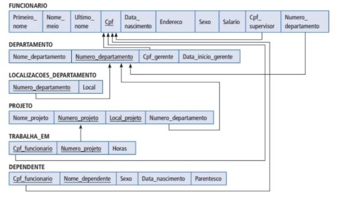
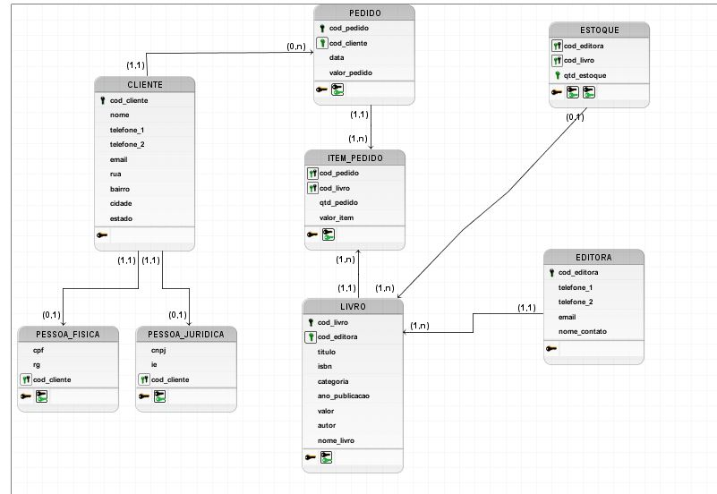

# Iniciando curso

O modelo lógico de dados é criado a partir das descrições dos dados representadas em um modelo conceitual. Ele descreve como os dados serão armazenados no banco de dados, identificando as entidades, os atributos, as chaves primárias e estrangeiras e os seus relacionamentos.

Há duas formas que podemos utilizar para representar o modelo lógico: a forma horizontal ou a forma vertical. Durante o curso foi utilizado a representação vertical, onde os atributos (que mais a frente serão chamados de campos) são representados um abaixo do outro, os atributos chaves são identificados e os relacionamentos são representados através de linhas ligando uma relação à outra:

Na forma horizontal, os atributos (campos) são apresentados um ao lado do outro, os atributos chave são sublinhados nas relações e os relacionamentos são representados através de uma seta, que sai da relação dependente e chega à relação proprietária. Já as cardinalidades não são representadas, como no exemplo a seguir:

As duas formas são válidas e podem ser utilizadas para representar o modelo lógico de dados. Normalmente a forma mais utilizada é a forma vertical, por ser semelhante a representação final das relações em um banco de dados.

### Modelo lógico

O nome que daremos para as entidades no modelo lógico é relação.

No brModelo ele trata o nome relação como nome de tabela, isso pode variar de software para software.

Aqui no modelo lógico vamos utilizar os nomes das tabelas com letra maiúscusla e o nome dos atributos como letra minúscula.

Os atributos no modelo lógicos vão receber o nome de campo.

As chaves pretas são as chaves primárias e as chaves verdes são as chaves estrangeiras.

### SQL Power Architect

Vamos utilizar esse software para fazer o modelo fisico do banco de dados.

Aqui no modelo físico para representar os atributos vamos utilizar o nome colunas.

Durante esse curso o instrutor utilizará o software SQL Power Architect para a criação do modelo físico do projeto, porém essa não é a única ferramenta existente para trabalharmos nessa etapa da modelagem. Apresentaremos aqui outras opções para que você experimente e aprenda um pouco mais sobre outros softwares que podem ser utilizados nesse processo.

- O MySQL Workbench é uma ferramenta muito utilizada na modelagem de banco de dados. Trata-se de um software bem completo que nos possibilita criar todos os processos de modelagem de banco de dados além de fazer alterações no banco de dados, que normalmente seriam mais trabalhosas utilizando recursos-chave de modo que seja preciso menos tempo e esforço nesses processos.

- A Astah Professional é outro software que consegue abranger todas as etapas do processo de modelagem de banco de dados. Ele permite gerar códigos a partir dos diagramas criados ou fazer uma engenharia reversa nos códigos existentes.

- O DBDesigner 4 possui uma interface bem intuitiva o que facilita sua aplicação Ele é muito utilizado nas faculdades durante o processo de aprendizagem de modelagem. Essa ferramenta também pode ser utilizada em conjunto com o MySQL.

A escolha do software vai depender muito da sua preferência e necessidade, já que a maior parte deles possuem funcionalidades parecidas. É interessante utilizar um software que já esteja no mercado a algum tempo e seja confiável, como todos esses exemplos que falamos aqui. Sugerimos que leia um pouco mais a fundo sobre o software que irá escolher para trabalhar antes de começar seu projeto, levando em conta as necessidades específicas do seu projeto.

### Type

O tipo da coluna. Esses tipos fazem referência ao domínio da coluna. O domínio designa o tipo de dado que será aceito na coluna.

- VARCHAR: Aceita dados do tipo alfanuméricos, ou seja, tanto letras quanto números. Porém o número é tratado como texto e não como número. A vantagem disso é que quando temos um campo de cpf o número do tipo texto não ignora os 00 no começo dos números, diferente do número do tipo número onde quanlquer zero anterior nã tem valor nenhum e ele só ignora.

- DATE: Serve para data.

- INTERGER: Só aceita números inteiros.

- DECIMAL e FLOAT: Trabalham com números decimais.

- INT: armazena valores numéricos inteiros.

- VARCHAR: armazena valores de string de tamanho variável de acordo com o seu limite.

- CHAR: armazena valores de string de tamanho fixo.

- TEXT: armazena valores de string de tamanho variável.

- TIME: armazena apenas valores de hora.

- TIMESTAMP: armazena valores de data e hora.

Esses são apenas alguns exemplos de tipos dados que podem ser utilizados para definir o domínio de uma coluna. Essa utilização também pode variar de SGBD para SGBD.

O relacionamento identificador é aquele na qual uma ocorrência da entidade fraca, precisa estar associada a exatamente uma ocorrência da entidade forte e não pode existir sem ela. Nesse caso, esse relacionamento é utilizado para representar uma chave primária estrangeira. Já no relacionamento não identificador, cada ocorrência da entidade fraca pode ser identificada sem a necessidade de saber a qual ocorrência da entidade forte está associada. É utilizado para representar apenas chaves estrangeiras.

